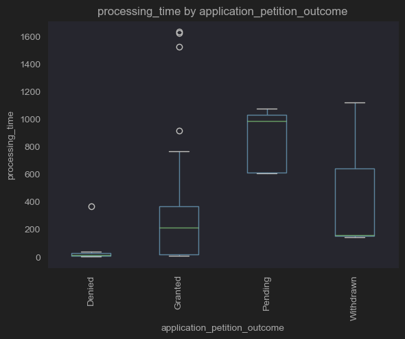
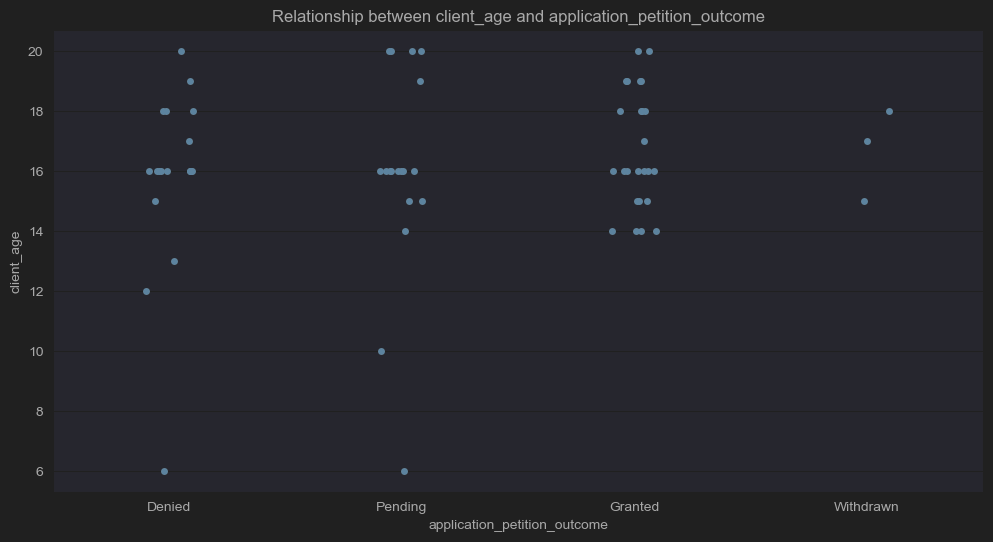
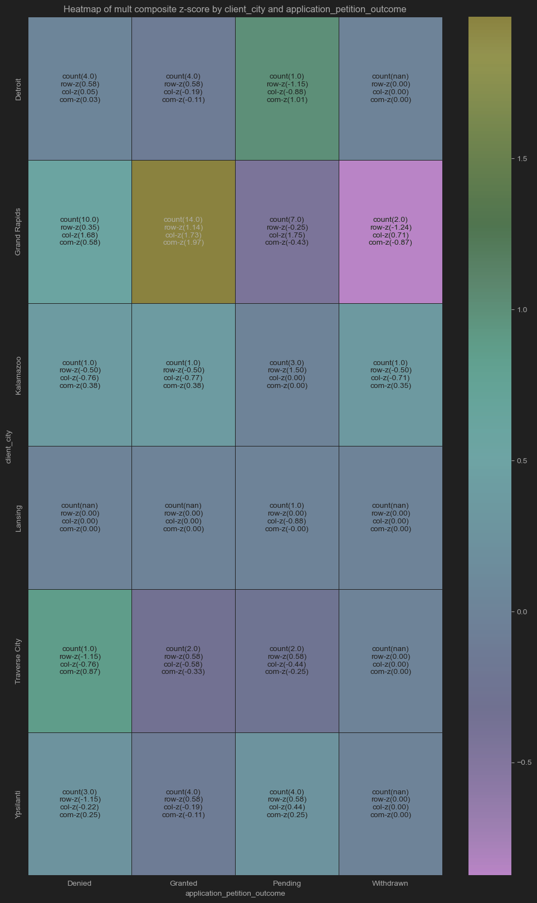
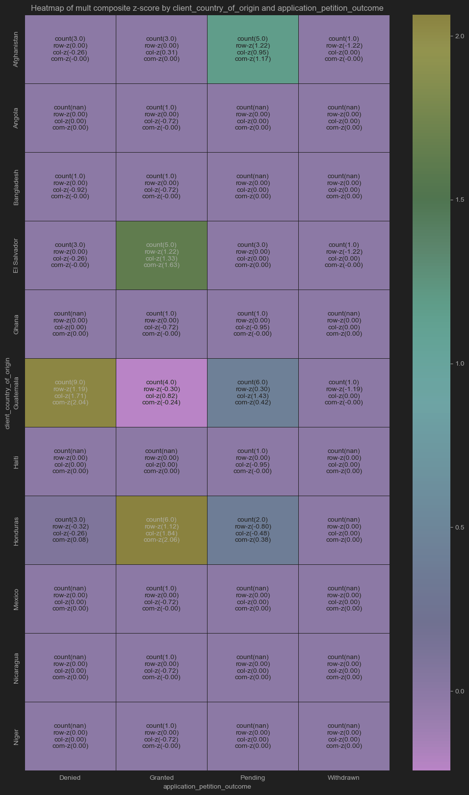
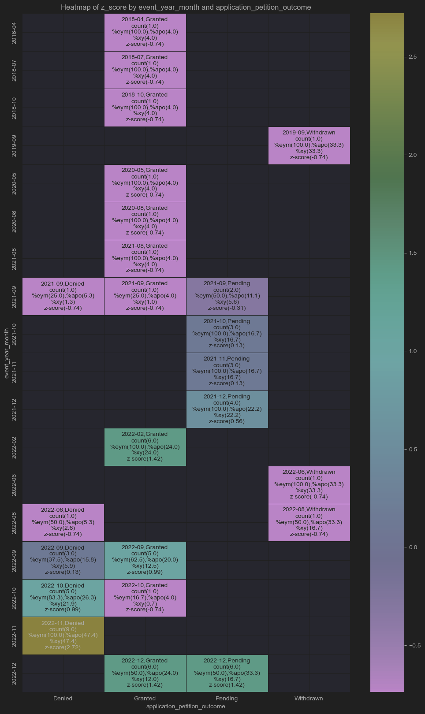
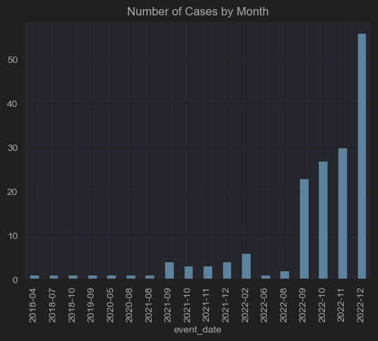
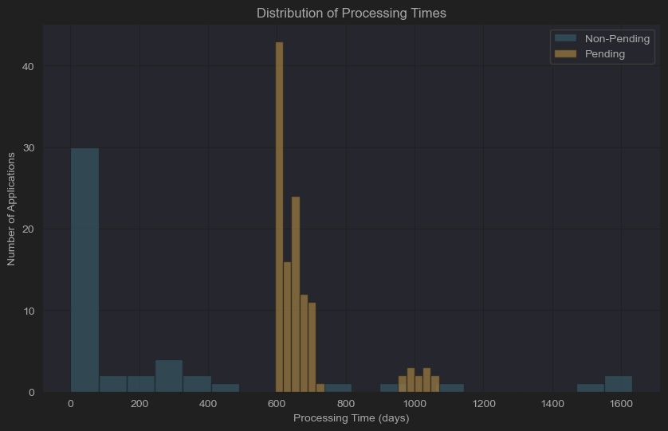
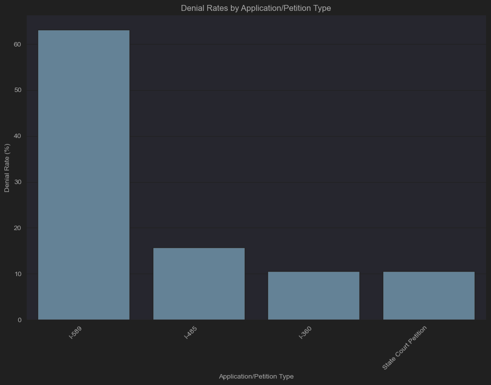

## Analysis Insights

### Processing Time by Application Outcome
- **Denied Applications**: The processing time by outcome box plot indicates that applications resulting in denial generally experience shorter processing times.
- **Granted Applications**: These cases are typically resolved within a year; however, some cases exhibit significantly extended processing times.

### Client Age and Application Outcome
- **Age 16**: Analysis of multiplicative Z-score heatmaps reveals a higher correlation between age 16 and denials.
- **Outcome Variability**: Results from both average and multiplicative Z-score analyses show that being 16 years old can either slightly increase or substantially decrease the probability of receiving a granted outcome.
- **Age 14**: The jitter scatter plot analysis demonstrates that clients under the age of 14 have not been granted or withdrawn.

### Geographic and Demographic Influences
- **Court Location**: Both average and multiplicative Z-score heatmaps consistently indicate a higher correlation with granted outcomes for clients from Grand Rapids.

- **Country of Origin**:
  - **Guatemala**: Associated with a higher likelihood of denials.
  - **El Salvador and Honduras**: Associated with a higher likelihood of granted outcomes.
  - **Other Countries**: Show mixed results depending on the Z-score method employed.

### Processing Times Over Time
- **November 2022 Spike**: The heatmap of processing times by year, month, and outcome reveals a significant increase in denials during November 2022, which may warrant further investigation.

- **Trend of Increasing Processing Times**: A general increase in processing times is observed, correlating with a notable rise in case numbers since September 2022 and an additional spike in December 2022.

### Pending Cases Analysis
- **Histogram of Processing Times**: The histogram displays two distinct groups of pending cases—one cluster around 600-700 days and another around 1,000 days—indicating varying factors affecting resolution times.
- **Resolved Cases**: Generally non-pending cases were resolved within the first 100 days.

### Application Types
- Federal forms like I-589 and I-485 have higher denial rates.
- I-589s especially have high rates of denials, which would make sense that a client seeking asylum would have less of a support network, and would then be more likely to make administrative errors that would result in a denial.

## Data Recording Enhancements

For clients aged 20 and under, consider adding the following data:

- **Current Grade Level:** To understand their educational context.
- **School Attendance:** To address any school-related issues.
- **Parent/Guardian Details:** Including their immigration status.
- **Household Size:** For broader context.
- **Health Conditions:** That might impact their case.
- **Language Proficiency:** To gauge their level, especially if they're still learning.

To enhance our tracking, we could ask clients to update us on any demographic or life changes during each consultation. Additionally, we should keep a timeline of these changes to analyze their impact on outcomes. For instance, if a client moves from middle school to high school, we could create a "changed schools" true/false column to analyze this transition.

